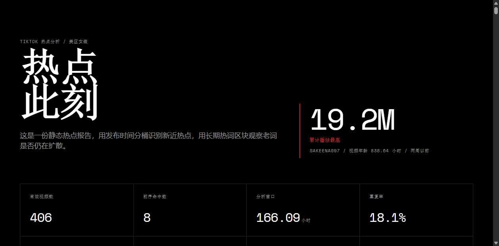
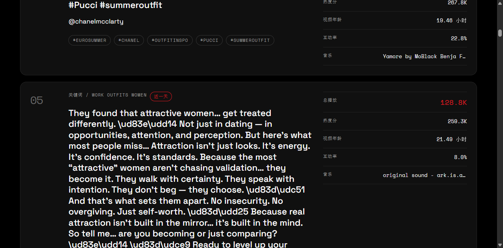
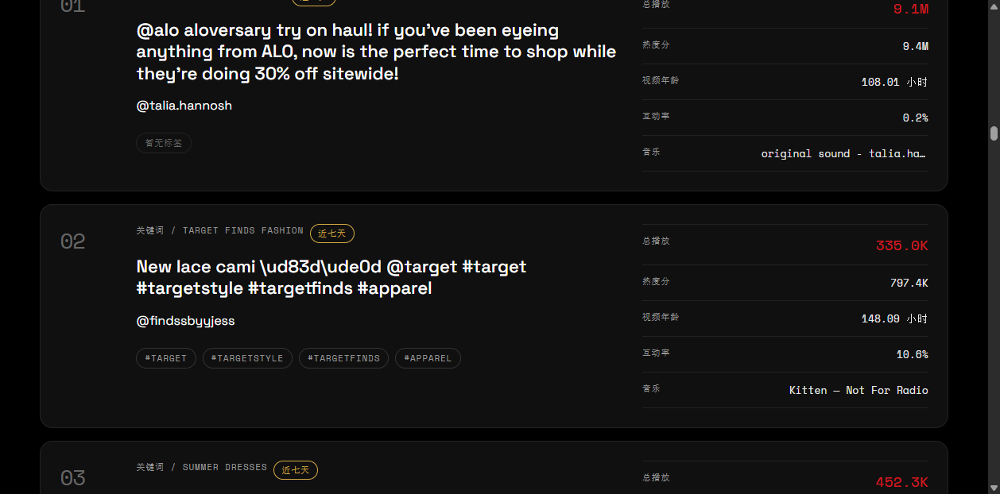

<p align="center">
  <a href="README.md">中文</a> | <a href="readme-en.md">English</a>
</p>

# TikTok Hotspot Monitor Skill

TikTok 热点监控 Skill。通过 Apify Actor 或 Playwright 本地抓取 TikTok 视频 metadata，离线分析热点信号并生成静态 HTML 报告。

本 Skill 默认配置了一套**美区女装关键词**作为示例，你也可以自定义任意关键词、话题标签、达人、音乐源，监控任何领域的热点。

## 架构

```
┌─────────────────────────────────────────────────────┐
│                   Agent Skill                        │
│  ┌─────────┐   ┌──────────┐   ┌──────────────────┐  │
│  │  抓取   │──▶│  分析    │──▶│  HTML 报告       │  │
│  │ Apify / │   │ 热度 +   │   │  静态深色主题    │  │
│  │  MCP    │   │ 覆盖度   │   │                  │  │
│  └─────────┘   └──────────┘   └──────────────────┘  │
│        │              │                │             │
│        ▼              ▼                ▼             │
│  snapshot.jsonl  analysis.json    report.html        │
└─────────────────────────────────────────────────────┘
```

## 10 层结构

本 Skill 遵循成熟 Agent Skill 框架设计：

| 层 | 说明 | 实现位置 |
|----|------|----------|
| 1. 任务边界 | 负责什么 / 不负责什么 | `skill.md §1` |
| 2. 输入契约 | 配置、CLI、环境变量格式 | `skill.md §2` |
| 3. 输出契约 | JSONL、JSON、HTML 格式定义 | `skill.md §3` |
| 4. 工具定义 | 脚本调用规则与禁止场景 | `skill.md §4` |
| 5. 状态机 | 抓取→分析→报告流转 | `skill.md §5` |
| 6. 错误恢复 | 每种失败的处理步骤 | `skill.md §6` |
| 7. 规划逻辑 | 任务拆解与决策路径 | `skill.md §7` |
| 8. 约束系统 | 成本/时间/频率/安全限制 | `skill.md §8` |
| 9. 评估机制 | 各阶段成功/失败阈值 | `skill.md §9` |
| 10. 可组合性 | 文件级契约与其他 Skill 集成 | `skill.md §10` |

## 快速开始

### Apify 模式（主力）

```bash
# 1. 安装依赖
pip install apify-client

# 2. 设置 Apify API Token
echo "APIFY_TOKEN=你的token" > .env

# 3. 抓取（10 源 × 窗口权重分配）
python scripts/crawl_tiktok_hotspots.py --once

# 4. 分析
python scripts/analyze_tiktok_hotspots.py

# 5. 生成报告
python scripts/render_tiktok_hotspot_report.py
```

### 本地抓取（Playwright MCP 备用模式）

当 Apify Token 不可用或只想做小规模测试时，可以使用本地 Playwright 模式：

```bash
# 1. 安装依赖
pip install playwright
playwright install chromium

# 2. 保存 TikTok 登录态（需要手动扫码登录）
python scripts/tiktok_login_save_session.py

# 3. 切换配置中的 provider 类型
# 编辑 config/tiktok_hotspot_sources.json，将 provider.type 改为 "tiktok_mcp"
# 确保 tiktok_mcp.args 指向正确的适配器脚本

# 4. 本地抓取（每关键词约 12 条，TikTok 网页搜索上限）
python scripts/crawl_tiktok_hotspots.py --once --max-sources 2
```

**MCP 配置示例：**
```json
{
  "provider": {
    "type": "tiktok_mcp"
  },
  "tiktok_mcp": {
    "command": "python",
    "args": ["scripts/tiktok_search_mcp_adapter.py"],
    "timeout_seconds": 120,
    "reject_simulated": true,
    "env": {}
  }
}
```

**MCP 模式限制：**
- 每关键词最多返回 12 条视频（TikTok 网页端限制）
- 仅支持 `keyword` 和 `hashtag` 源类型，不支持 `creator` 和 `music`
- 需预先保存 TikTok 登录态（session 有效期不定）
- 无窗口权重分配（每次搜索直接使用完整 limit）
- 适合小规模验证，>200 条建议使用 Apify 模式

## 文件结构

```
skills/tiktok-hotspot-monitor/
├── skill.md               # Agent 指令（10 层完整定义）
├── README.md              # 本文档
├── metadata.json          # 机器可读元数据
├── requirements.txt       # Python 依赖
├── examples/
│   ├── report.html                    # 完整示例报告
│   ├── report_preview.png             # 概览截图
│   ├── report_top.png                 # 顶部截图
│   ├── report_mid.png                 # 中部截图
│   └── report_bottom.png              # 底部截图
├── scripts/
│   ├── crawl_tiktok_hotspots.py          # 主爬虫
│   ├── analyze_tiktok_hotspots.py        # 离线分析器
│   ├── render_tiktok_hotspot_report.py   # HTML 报告生成
│   ├── tiktok_search_mcp_adapter.py      # Playwright 本地适配器
│   └── tiktok_login_save_session.py      # 登录态保存
└── config/
    ├── tiktok_hotspot_sources.json       # 主配置
    ├── _tiktok_hotspot_apify_500_config.json  # 500 条验证配置
    └── .env.example                      # 环境变量模板
```

## 报告预览





完整示例报告：[examples/report.html](examples/report.html)

## 输出目录

所有输出在项目 `data/` 目录下：

```
data/tiktok_hotspots/
  snapshots/tiktok_hotspots_<时间戳>.jsonl    # 原始记录
  logs/tiktok_hotspots_<时间戳>.jsonl         # 运行日志 + 轮次摘要
data/tiktok_hotspot_analysis/
  tiktok_hotspot_analysis_<时间戳>.json       # 分析结果
  tiktok_hotspot_report_<时间戳>.html         # 深色主题报告
```

## 集成方式

其他 Agent 通过文件路径消费输出：

```python
import json
report = json.load(open("data/tiktok_hotspot_analysis/latest_analysis.json"))
top_signals = report["top_videos"][:5]
```

## 版本记录

- 1.0.0：初始版本。支持 Apify Actor 抓取（含 5 窗口高赞优先策略）和 Playwright MCP 本地验证，离线分析（热度分/覆盖分/新词检测），静态 HTML 报告生成。

## 开源协议

MIT License。详见项目根目录 [LICENSE](LICENSE) 文件。
